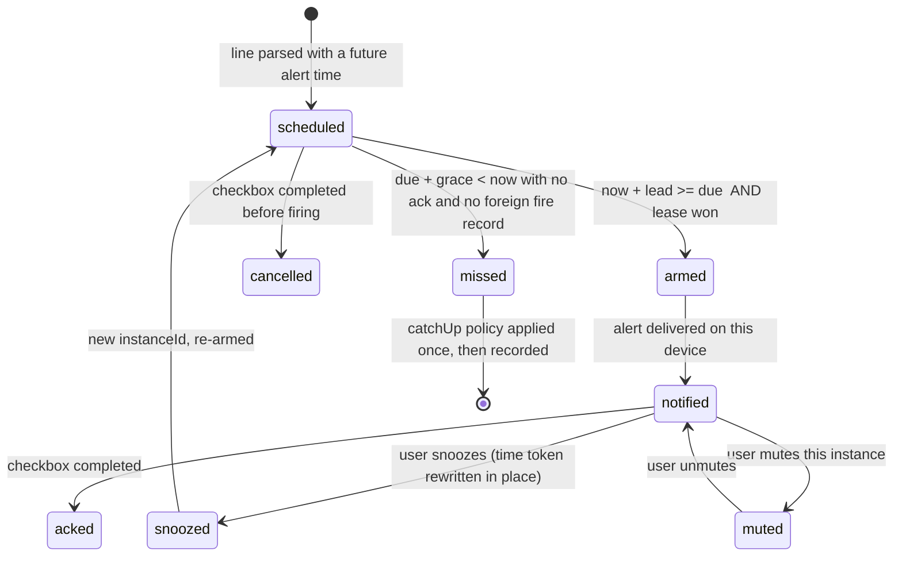

# Kairos — Reminder Instance Model, Scheduling and Sync Safety

Status: **frozen for v0.1** · Depends on: `docs/spec/syntax.md`

Principle: **the note is the source of truth; state files are bookkeeping that may be lost without
data loss.** Delete every file under `state/` and Kairos still knows what to remind you about — it
loses only "already fired" and "snoozed" history. That property is what makes sync conflicts
survivable.

---

## 1. Instance identity

```
instanceId = sha256( vaultId ‖ relPath ‖ blockId? ‖ dueLocalISO ‖ occurrenceIndex )
```

- `vaultId` — random UUID generated once per vault, stored in `data.json`. Prevents a copied vault
  from re-firing everything.
- `relPath` — normalised, vault-relative, no leading slash.
- `blockId` — the `^block-id` when the line has one; empty otherwise. Preferred identity when
  present because it survives edits above the line.
- `dueLocalISO` — `YYYY-MM-DDTHH:mm` in **local wall clock**, never an epoch. An epoch is a promise
  about a timezone; a wall clock plus an IANA zone is what a user means by "9am".
- `occurrenceIndex` — 0 for one-shots, n for the nth occurrence of a recurrence (Phase 2).

Consequences: editing the title does **not** re-key (title is deliberately absent) → the fired-log
survives typos. Moving the time to 09:50 **does** re-key → a snooze is literally a new instance, so
"did it fire?" is answered by identity, not by a mutable flag.

## 2. Record

```ts
interface ReminderRecord {
  schemaVersion: 1;
  instanceId: string;
  sourcePath: string;          // vault-relative note path
  blockId?: string;
  line: number;                // best-effort; identity does not depend on it
  titleHash: string;           // detects "same id, different content" drift
  title: string;               // for the agenda view and payloads
  dueLocal: string;            // 'YYYY-MM-DDTHH:mm'
  tzId: string;                // IANA zone captured at scheduling time
  utcOffsetMinutes: number;    // captured with tzId, used to detect DST/zone drift
  severity: 'alarm' | 'digest';
  catchUp: 'fire_now_with_age' | 'fold_into_digest' | 'skip_and_mark_missed';
  state: 'scheduled' | 'armed' | 'notified' | 'snoozed' | 'acked' | 'muted' | 'missed' | 'cancelled';
  snoozeCount: number;
  supersedes?: string;         // predecessor instanceId when born from a snooze
  pushId?: string;             // legacy, single-channel: migrated to `pushIds` on load
  pushIds?: Record<string, string>; // message id of the pending registration, per channel id;
                                    // "" means registered but the provider returned no handle
  pushFor?: string;            // the dueLocal those registrations were made for
  pushFor?: string;            // the dueLocal value the push was registered for
  lease?: { deviceId: string; seq: number; expiresAt: number };
  firedBy: string[];           // deviceIds
  firstSeenAt: number;         // epoch ms
  updatedAt: number;
}
```

## 3. State machine



Rules that are easy to get wrong, so they are stated here then tested:

- **Never fire from a tick count.** Every tick recomputes the due set from the index. Chromium
  clamps hidden-window timers to ≥1 s and switches to once-per-minute intensive throttling after
  ~5 minutes hidden, so tick *counts* are meaningless; tick *wall-clock* is not.
- **Ticks are serialized.** They arrive from the interval, the wake timer, a rescan, an ack and a
  snooze; overlapping ticks would see the same instance as due and deliver it twice. A tick that
  arrives while one is running joins it. Delivery additionally claims the instance in the fired log
  *before* awaiting the channel, because the channel is the slow step.
- **The alert fires at `due`.** `leadMinutes` opens the arming window (`scheduled → armed`, lease
  claimed) and nothing more; no setting may make an alert early. Inside the window the timer wakes at
  `due`, which also keeps a passed `armAt` from spinning the timer.
- **One timer.** A single `setTimeout` armed to the earliest `due − lead` in the index, re-armed on
  every index change. No per-reminder timers.
- **Dedupe window.** An instance that fired on this device is recorded in the fired-log; a repeat
  within 60 s is suppressed even if the index is rebuilt.
- **Lease, not agreement.** Cross-device single-fire is decided by a lease file
  (`lease = {deviceId, seq, expiresAt}`) written create-only and renewed only with a non-decreasing
  `seq`; TTL ≥ 2× the worst plausible clock skew (default 5 minutes). The arming window renews the
  claim on every pass, so a `leadMinutes` longer than the TTL still reserves the alarm, and `armed`
  means "this device holds the claim and is waiting for `due`" — a *refused* claim leaves the record
  `scheduled`, is reported in `blockedByLease`, and is retried on the next tick. If the lease cannot
  be read (Obsidian Sync disabled for `.obsidian`, or a vault synced by a non-Obsidian tool), Kairos
  still fires locally and records the fire; it degrades to per-device firing, never to silence.
- **A snooze successor owns its time.** `snooze()` marks the predecessor `snoozed` and sets
  `supersedes` on the successor. `sync()` forces any index-derived instance that is in the
  `superseded` set to `snoozed`, so a note still carrying the old time cannot fire beside its
  successor; a `snoozed` record absent from the index is pruned because its old time left the note.
  The in-note rewrite is skipped when the snooze crosses midnight — `00:20` written under yesterday's
  date would re-parse as a different, already-past instance.
- **Catch-up on launch.** At `onLayoutReady`, instances with `due + grace < now` and no ack apply
  their `catchUp` policy. Default `grace` is 15 minutes; default policy is `fire_now_with_age`
  (the alert says "09:00 — 2h ago"), because a silently dropped alarm is the single most common
  complaint in this market. `skip_and_mark_missed` exists for people who hate late alerts.
- **One push per due time.** A server-scheduled channel is a mirror of the index, not a delivery
  target: the engine registers a reminder ahead of its due time, stores the provider's message id and
  the `dueLocal` it was registered for on the record (`pushFor`), and publishes nothing again while
  those still match. The fire for a due time the registration covers delivers through the local
  channels only — ntfy clamps a schedule that has already begun to ten seconds out
  (`MIN_SERVER_DELAY_SECONDS`), so republishing there would land a second alert ten seconds after the
  first. A fire no registration covers (the reminder came due while the app was closed, or a fold
  fires at its window) publishes immediately on every configured channel: the provider clamps it to
  its minimum delay, and that late push is the only delivery that due time will ever have. A pending
  registration whose due time is still ahead is withdrawn by message id when it is no longer wanted;
  one whose due time has passed is dropped from the record without a delete, because a delivered
  notification that is deleted is read by ntfy's clients as the user dismissing it. A record still
  `scheduled` or `armed` keeps its marker until it has fired, whatever its due time reads: the
  catch-up that is about to fire it reads `pushFor` and stays local, and the pass after that fire is
  the one that drops the marker. Traced in the real app on 2026-09-11: one reminder, three deliveries
  (two at the due second, one at due+10 s) before this rule held.
- **Record-set operations are serialized.** `load`, `sync`, `syncServerScheduled`, `ack`, `setMuted`
  and the snooze writes run one at a time in a FIFO queue; a pass queued behind another runs after it
  and reads its clock once it owns the queue, so a pass that waited cannot mistake an already-started
  due time for a future one. Ticks stay outside the queue (they join the running one). The rule exists
  because two overlapping passes both read a record whose registration had not been written yet and
  both published — the two push ids two seconds apart in that same trace.
- **Two severities.** `alarm` = interrupt now (OS notification, sound, modal). `digest` = batched at
  a user-configured window (default 08:00 and 18:00). A reminder whose written time is inside quiet
  hours is a digest item, decided when the note is parsed. A catch-up older than `grace` keeps its own
  severity and applies its policy instead: `fire_now_with_age` (the default) delivers it with its age,
  `fold_into_digest` delivers it as a digest at the next window — that window is chosen once, by the
  pass that notices the miss, so a pass running after a window cannot push the item to the following
  one — and `skip_and_mark_missed` records it without an alert. This is HCI-grounded: interruptive
  notifications cost ~23 minutes of refocus (Mark et al., CHI 2008), deferring to breakpoints
  reduces frustration (Iqbal & Bailey, CHI 2008), and batching improves wellbeing (Fitz et al.,
  2019). Shipping only alarms would make this plugin the thing users uninstall in week two.

## 4. Storage layout

```
.obsidian/plugins/kairos/
  data.json                       # settings only: flat scalars, no secrets beyond channel tokens
  state/
    instances/<instanceId>.json   # created once, then updated via Vault.process (atomic)
    acks/<instanceId>.<deviceId>.json      # create-only, never rewritten  → LWW-safe
    lease/<instanceId>.json       # tiny; the only contended file
    fired/<deviceId>-<yyyymmdd>.jsonl       # append-only, per device, never shared
    devices/<deviceId>.json       # heartbeat: platform, plugin version, tz, last seen
```

Why this shape — Obsidian Sync semantics are load-bearing here:

- `.md` files are auto-merged with `diff-match-patch` and **merging can duplicate text**; that is
  why user-visible state stays in the note (a checkbox) and never in a shared JSON.
- Non-Markdown files are **last-modified-wins**, so any file with two writers is a silent data-loss
  bug. Hence: one writer per file, create-only where possible, per-device filenames for logs.
- `.obsidian/*.json` merges "local keys on top of remote", which is safe for scalars and unsafe for
  arrays/sets — so settings stay flat and reminder lists are never stored as arrays in `data.json`.
- Conflict strategy is a per-device user setting; we assume the worst and never depend on it.

**Optional shared-state mode.** Cross-device lease/acks only work if state syncs. Obsidian Sync can
sync `.obsidian`; iCloud/OneDrive/Syncthing users may not want it to. A setting
`stateLocation: 'plugin-dir' | 'vault-folder'` relocates `state/` to `.kairos/` in the vault
(synced by everything, visible in the file explorer only if the user shows hidden folders). Default
is `plugin-dir`; the tradeoff is stated in the setting's description, not hidden in docs.

## 5. Secrets

There is no secret API in `obsidian.d.ts`, and Electron's `safeStorage` is desktop-only. So:

- Channel tokens live in `data.json` as plaintext and the plugin says so in the UI when a token
  field is focused, plus in the README.
- Minimise blast radius: ntfy topics are treated as **capability URLs** (long random topic name =
  the secret), Pushover/Bark/Telegram keys are scoped to one purpose, and every channel has a
  "Test" button plus a "Send nothing but the title" mode that is the default.
- Payload content is user-controlled: default payload is the **task title only** (never note body,
  never vault paths beyond the configurable "include note name" opt-in).

## 6. Performance contract

- `onload` does nothing expensive. Indexing starts at `onLayoutReady`.
- The index is built from `metadataCache.getFileCache(file).listItems` plus `cachedRead`, not by
  re-reading every file, and updated from `metadataCache.on('changed')` debounced per file.
- Only notes that are date-scoped or contain explicit date/time tokens are kept in the index; the
  rest are skipped after a cheap prefilter.
- Work is budgeted: a rescan yields between files (`await` a microtask every N files) so the UI
  never blocks — the headline fix in Tasks 8.3.0 was exactly this failure mode.
- Reference budget: 10,000 notes / 50,000 list items indexed in < 1.5 s cold, with steady-state
  incremental cost proportional to changed files only. Measured numbers land in
  `docs/perf.md` once the benchmark script exists; until then this is a target, not a claim.

## 7. Failure modes we deliberately accept

| Failure | Behaviour | Why acceptable |
|---|---|---|
| Obsidian closed at alert time, desktop | No alert; catch-up on next launch | Platform limit: no plugin runs while the app is closed |
| Obsidian mobile backgrounded/closed | No push **from the plugin**; ICS/ntfy/cron tiers cover it | Platform limit, verified against Obsidian docs and Reminder's own docs |
| Lease file unreachable (no `.obsidian` sync) | Fire on each device, dedupe locally | Silence is worse than a duplicate |
| Two devices snooze simultaneously | Last writer wins in the note; both wrote a new token | Rare, visible, and recoverable by hand |
| Title edited between index and fire | Alert shows the title from index time | Re-parse before firing when the file is cheap to read |
